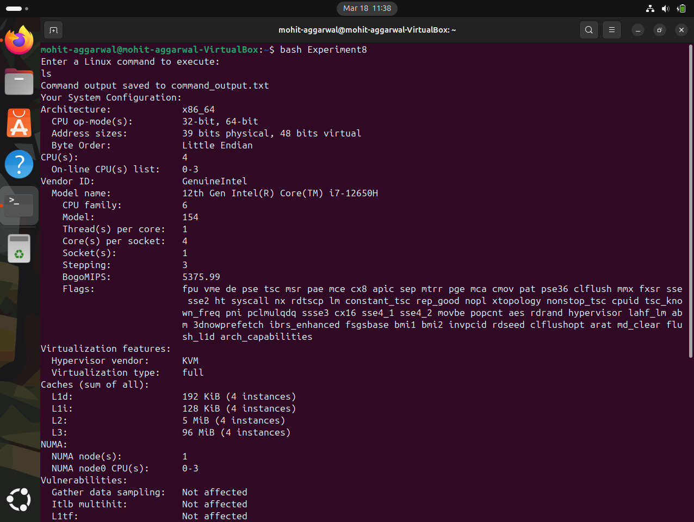
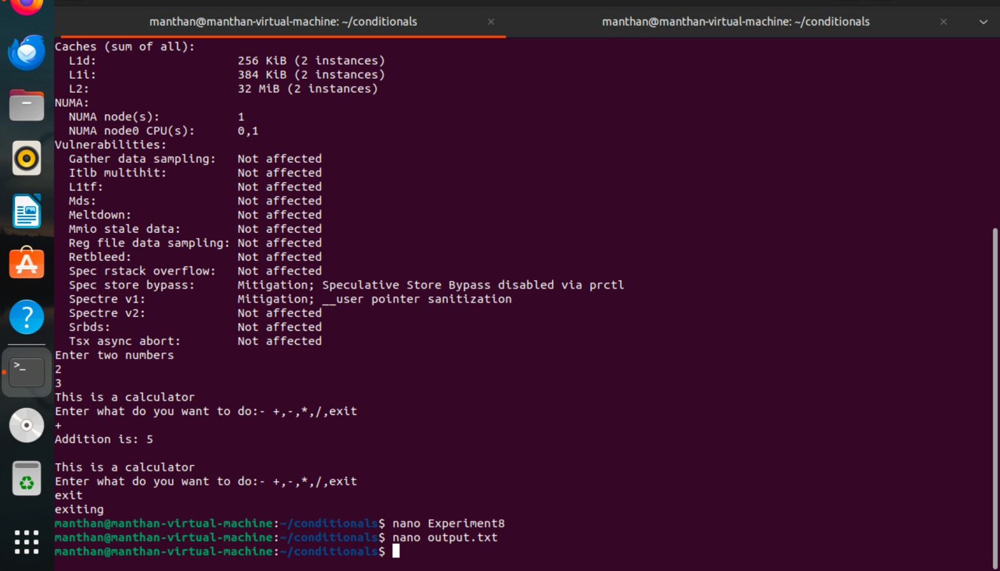
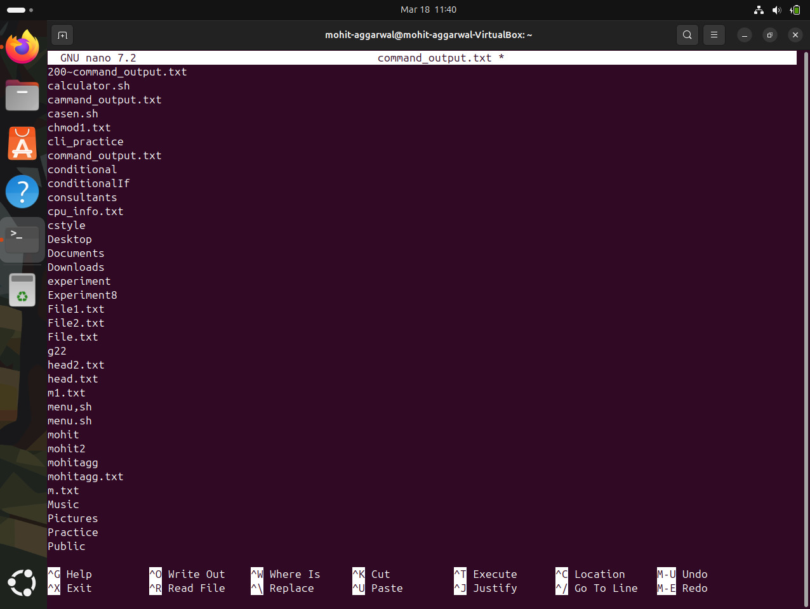

# Experiment 8

---

## Experiment Description
This lab focuses on creating and executing shell scripts in Linux to gather system information and perform basic mathematical operations. Additionally, redirection operators are used to store command outputs in files.

---

## Approach

### 1. Steps to Create and Run a Shell Script
1. Open the terminal.
2. Create a new shell script file using the `touch` command:
   ```bash
   touch Experiment8.sh
   ```
3. Open the file in a text editor:
   ```bash
   nano Experiment8.sh
   ```
4. Write the script inside the file.
5. Save and exit the editor (`CTRL + X`, then `Y`, and `Enter`).
6. Give execution permissions to the script:
   ```bash
   chmod +x Experiment8.sh
   ```
7. Run the script:
   ```bash Experiment8t.sh
   ```
8. Follow the prompts to enter inputs and perform calculations.
9. Check the stored output in the generated file.

---

### 2. Shell Script to Print System Information

```bash
# Display the system configuration
echo "Your System Configuration:"
lscpu  # Display CPU information
```

#### Screenshot:


---

### 3. Shell Script to Perform Basic Mathematical Calculations

```bash
#!/bin/bash
# Prompt user to enter two numbers for mathematical operations
echo "Enter Two Numbers:"
read Number1
read Number2

# Loop for continuous operation until user exits
while true; do---
    echo "Enter operation (+, -, *, /) or type 'exit' to quit:"
    read char  # Read operation input

    case $char in
        '+') echo "Addition: $((Number1 + Number2))" ;;
        '-') echo "Subtraction: $((Number1 - Number2))" ;;
        '*') echo "Multiplication: $((Number1 * Number2))" ;;
        '/') 
            if [ "$Number2" -ne 0 ]; then
                echo "Division: $((Number1 / Number2))"
            else
                echo "Error: Division by zero is not allowed."
            fi----
            ;;
        "exit") 
            echo "Exiting..."
            exit 0
            ;;
        *) echo "Invalid input. Please enter a valid operation." ;;
    esac
done
```

#### Screenshot:


---

### 4. Shell Script to Use redirection operators to store the output of input commands.

```bash
#!/bin/bash
# Prompt user to enter a system command
echo "Enter a Linux command to execute:"
read user_command  # Read user input

# Execute the command and store the output in a file
$user_command > command_output.txt
echo "Command output saved to command_output.txt"

```

#### Screenshot:


---

## Conclusion
In this lab, you practiced:
1. Creating and executing shell scripts in Linux.
2. Printing system information and storing it in a file.
3. Performing basic mathematical calculations using user inputs.
4. Using redirection operators to store command outputs.

Mastering shell scripting is essential for automating tasks and managing system operations efficiently.

